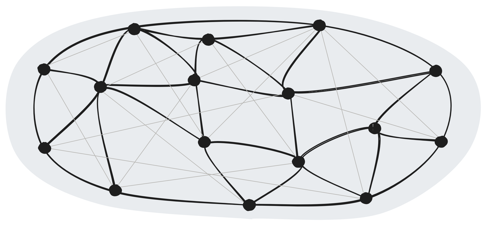

# WebPEER.js

WebPEER is a P2P Network that Runs in a Standard Browser.

[>DEMO<](https://nuzulul.github.io/webpeerjs/demo/chat.html)



## Security

WebPEER Network run over [`libp2p gossipsub`](https://docs.libp2p.io/concepts/security/security-considerations/#publish--subscribe) protocol to enables communication between peers. 
> By default, the gossipsub implementation will sign all messages with the author’s private key, and require a valid signature before accepting or propagating a message further. This prevents messages from being altered in flight, and allows recipients to authenticate the sender.

> However, as a cooperative protocol, it may be possible for peers to interfere with the message routing algorithm in a way that disrupts the flow of messages through the network.

## Features

* ✅ Distributed P2P
* ✅ Scalable Peers
* ✅ Works in Browsers
* ✅ Broadcast Messages

## Ideas

* Blockchain
* Voting / Polling
* Collaborative activity
* IoT
* social media
* Remote control
* Multiplayer games
* Distributed web
* Signalling protocol
* Location tracker
* Activity tracker.

## Try it out!

* Go to a deployed chat demo at : [p2pchat](https://nuzulul.github.io/webpeerjs/demo/chat.html) .
* Open the app on another device.
* Both your devices should connected.
* Now start sending message.

## Browser Support
     

## Quickstart

NPM install:

```
npm install webpeerjs
```

CDN :

* [https://esm.sh/webpeerjs](https://esm.sh/webpeerjs)

```
<script type="importmap">
{
	"imports": {
		"webpeerjs" : "https://esm.sh/webpeerjs"
	}
}
</script>
```

## Example

```
import { createWebPEER } from 'webpeerjs'

const config = {
	networkName : 'myNetwork'
}

const peer = await createWebPEER();

console.log(`My peer id : ${peer.id}`)

const room = peer.joinRoom('lobbyroom')

room.onMessage((message,id) => {
	console.log(`Message from ${id} : ${message}`)
})

room.onMembersChange((data) => {
	console.log(`Members : ${data}`)
	room.sendMessage('hello')
})
	
```

## API

### `peer = await createWebPEER(config)`

Create a new peer node.

`config` - Configuration object contains:

- `networkName` - Unique identifier name of your network.

- `rtcConfiguration` - **(optional)** Custom [rtcConfiguration](https://developer.mozilla.org/en-US/docs/Web/API/RTCPeerConnection/RTCPeerConnection) for WebRTC transport.
		
### `peer.id`

Get the unique ID of the peer node.

### `peer.status`

Get the peer node status, returns `connected` or `disconnected`.

### `room = peer.joinRoom(namespace)`

Join to a room, returns an object.

- `room.sendMessage()` - Function to broadcast message to the room.
- `romm.onMessage((message,id)=>{})` - Listen on incoming broadcast message.
- `room.onMembersChange((members)=>{})` - Listen on the room members update.

## See Also

- [p2p.js](https://github.com/nuzulul/p2p.js) - Alternative simple api WebRTC library with auto matchmaking without signaling server.

## License

[MIT (c) 2024](https://github.com/nuzulul/webpeerjs/blob/main/LICENSE) [Nuzulul Zulkarnain](https://github.com/nuzulul)

